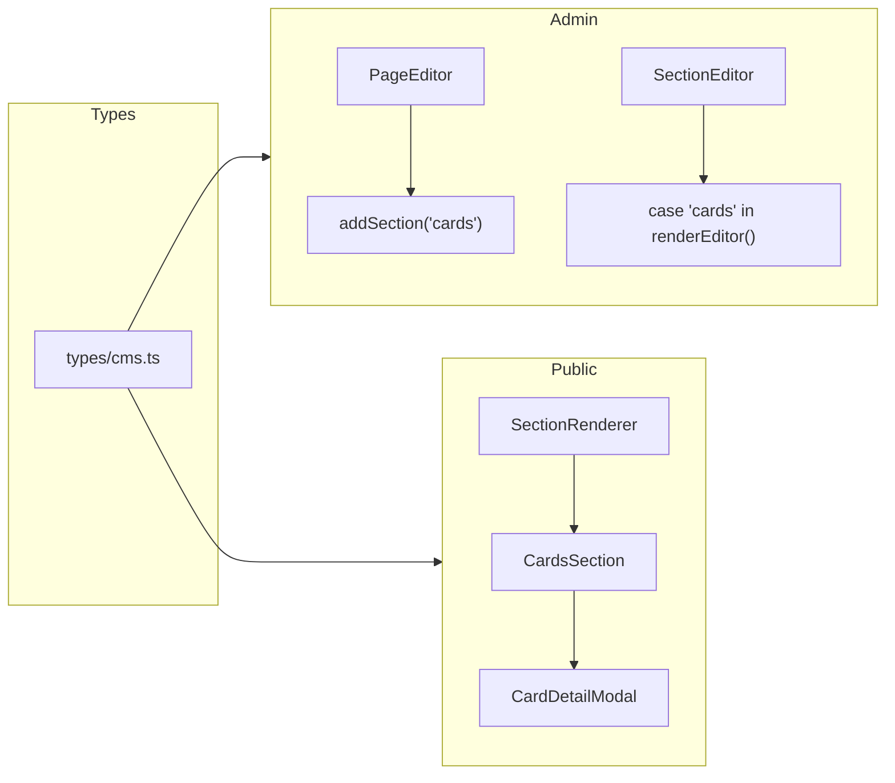

# Cards Section Implementation Plan

## Current architecture

Sections are stored in the existing `Section` model with `type` and JSON `content`. No schema change is required.

- **Admin:** [components/admin/PageEditor.tsx](components/admin/PageEditor.tsx) adds sections and [components/admin/SectionEditor.tsx](components/admin/SectionEditor.tsx) renders a form per section type via `renderEditor()`.
- **Public:** [components/public/sections/SectionRenderer.tsx](components/public/sections/SectionRenderer.tsx) switches on `section.type` and renders the matching component (e.g. `HeadingParagraphSection`).
- **Modal pattern:** [components/public/services/ServiceModal.tsx](components/public/services/ServiceModal.tsx) and [ServiceList.tsx](components/public/services/ServiceList.tsx) show the card → modal flow (state for selected item, overlay + Escape + body scroll lock).

---

## 1. Types

**File:** [types/cms.ts](types/cms.ts)

- Add `'cards'` to the `SectionType` union.
- Extend `SectionContent` with Cards section fields:
  - `title?: string` — section heading (displayed centered).
  - `subText?: string` — optional text below the title.
  - `cardsPerRow?: number` — 1, 2, or 3 (flex/grid columns).
  - `cards?: CardItem[]` — array of card items.

Define a `CardItem` interface (or inline in content):

- `image?: string` — card/icon image URL.
- `heading: string` — card title.
- `description?: string` — short card description.
- Optional modal-only fields (to match the 3rd reference): `overview?: string`, `technologies?: string[]`, `keyFeatures?: string[]`, `liveDemoUrl?: string`, `sourceCodeUrl?: string`.

---

## 2. Admin: default content and add button

**File:** [components/admin/PageEditor.tsx](components/admin/PageEditor.tsx)

- In `getDefaultContent(type)`, add:
  - `case "cards": return { title: "", subText: "", cardsPerRow: 3, cards: [] }`.
- In the green buttons area (next to "Add Heading + Paragraph"), add a button that calls `addSection("cards")` with label e.g. "Add Cards" or "Add Portfolio".

---

## 3. Admin: Cards section editor

**File:** [components/admin/SectionEditor.tsx](components/admin/SectionEditor.tsx)

- In `renderEditor()`, add `case "cards":` that renders:
  - **Title** — single line input bound to `content.title`.
  - **Sub-text** — textarea (optional) bound to `content.subText`.
  - **Cards per row** — number input or select (1 / 2 / 3) bound to `content.cardsPerRow`.
  - **Cards list** — map over `(content as any).cards` (or `[]`). For each card item:
    - Image URL input (reuse same pattern as Text+Image section).
    - Heading input.
    - Description textarea.
    - Optional: Overview, Technologies (e.g. comma-separated or one-per-line), Key features (one per line), Live demo URL, Source code URL (for the modal).
  - "Add card" button that appends a new object to `content.cards` and calls `setContent`.
  - Per-card "Remove" to splice the array and update content.
- Use the same styling and patterns as existing cases (e.g. `headingParagraph`, `textImage`) for labels and inputs.

---

## 4. Public: Cards section component

**New file:** `components/public/sections/CardsSection.tsx`

- **Props:** `content` with `title?`, `subText?`, `cardsPerRow?`, `cards?` (typed to match `SectionContent` / `CardItem`).
- **Layout:**
  - Wrapper section with same spacing as other sections (e.g. `py-12`, container, max-width).
  - Centered block: `text-center` for title and sub-text. Title: large, bold (e.g. `text-3xl md:text-4xl font-bold`). Sub-text: smaller, muted; render only if `subText` is present.
  - Cards container: use `cardsPerRow` to set grid/flex (e.g. `grid grid-cols-1 md:grid-cols-2 lg:grid-cols-3` with column count derived from `cardsPerRow`), single row of cards that wraps on small screens.
- **Each card:** image (Next.js `Image` or `img` with proper alt), heading, description, and a "View Details" (or similar) button.
- **State:** `selectedCardIndex: number | null` (or selected card object). Clicking "View Details" sets the selected index.
- **Modal:** When `selectedCardIndex !== null`, render `CardDetailModal` with the selected card, `onClose` (clear selection), and optionally `cards` + current index for Prev/Next navigation.
- Mark as `"use client"` because of modal state and click handlers.

---

## 5. Public: Card detail modal

**New file:** `components/public/sections/CardDetailModal.tsx`

- **Props:** `card: CardItem`, `onClose: () => void`, and optionally `allCards?: CardItem[]`, `currentIndex?: number`, `onNavigate?: (index: number) => void` for Prev/Next.
- Reuse the structure of [ServiceModal.tsx](components/public/services/ServiceModal.tsx): fixed overlay, `bg-black/50`, inner scrollable panel, close on overlay click and Escape, `body.style.overflow = 'hidden'` when open.
- **Content:** Card title at top; main image; optional "Project Overview" (overview text); optional "Technologies Used" (tags/pills from `technologies`); optional "Key Features" (bulleted list from `keyFeatures`); optional "View Live Demo" and "View Source Code" buttons (only if URLs are set).
- If Prev/Next is implemented: "Previous" / "Next" in header that call `onNavigate(index)` and disable at first/last.

---

## 6. Register cards in section renderer

**File:** [components/public/sections/SectionRenderer.tsx](components/public/sections/SectionRenderer.tsx)

- Import `CardsSection`.
- Add `case "cards": return <CardsSection content={section.content as any} />` (with proper typing if you export a shared content type for cards).

---

## 7. Styling and assets

- Use existing Tailwind and container patterns from [HeadingParagraphSection.tsx](components/public/sections/HeadingParagraphSection.tsx) and [ServiceModal.tsx](components/public/services/ServiceModal.tsx).
- Card styling: rounded corners, subtle shadow, consistent with the first reference image. Tag/pill styling for technologies can match the reference (light brown/amber).
- No new dependencies; image URLs can point to existing upload/Blob URLs or external URLs like other sections.

---

## Summary of files

| Action | File                                                                                                            |
| ------ | --------------------------------------------------------------------------------------------------------------- |
| Edit   | [types/cms.ts](types/cms.ts) — SectionType + SectionContent + CardItem                                          |
| Edit   | [components/admin/PageEditor.tsx](components/admin/PageEditor.tsx) — default content + Add Cards button         |
| Edit   | [components/admin/SectionEditor.tsx](components/admin/SectionEditor.tsx) — case "cards" editor UI               |
| Create | `components/public/sections/CardsSection.tsx` — section + card grid + modal state                               |
| Create | `components/public/sections/CardDetailModal.tsx` — modal content and Prev/Next (optional)                       |
| Edit   | [components/public/sections/SectionRenderer.tsx](components/public/sections/SectionRenderer.tsx) — case "cards" |

No database migrations; all data lives in `Section.content` JSON.