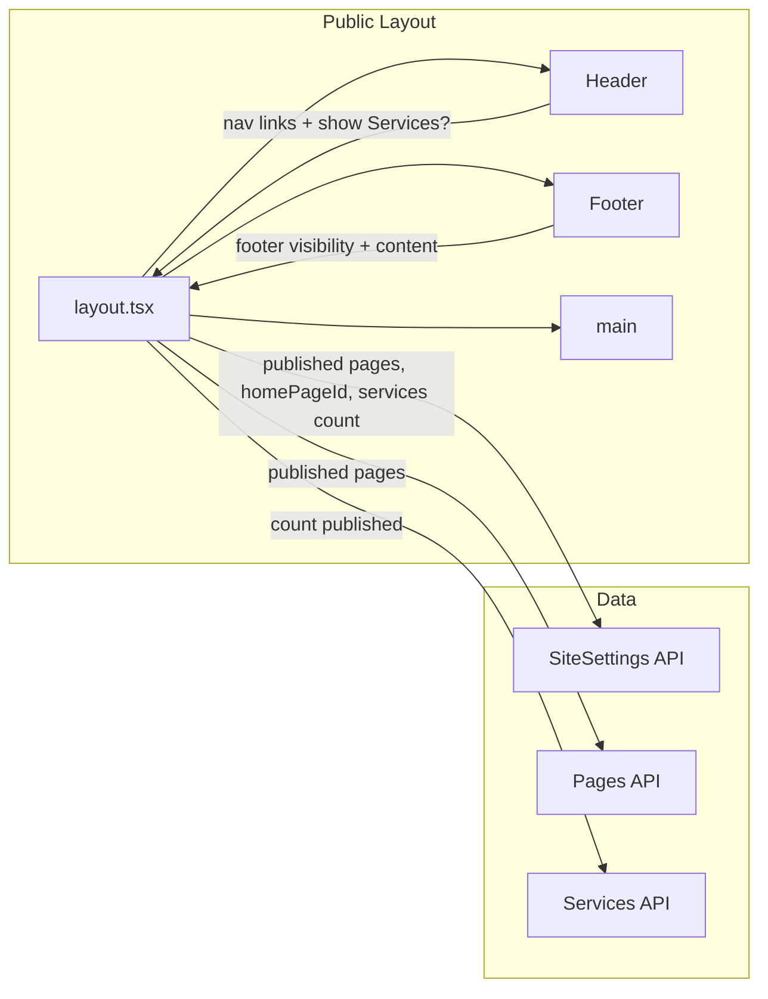

# CMS Update: Dynamic Header, Home Page, and Footer

## Current state

- **Header** ([components/public/layout/Header.tsx](components/public/layout/Header.tsx)): Hardcoded links (Home, About, Services, Contact). No CMS data.
- **Root route** ([app/(public)/page.tsx](app/(public)/page.tsx)): Looks for a page with `slug: "home"`; if published, renders it; otherwise shows a static “Welcome to Our CMS” block. No “nothing created” empty state or link to admin.
- **Pages**: [prisma/schema.prisma](prisma/schema.prisma) `Page` has `isPublished` but no “show in menu” or “set as home” concept. Home is implied by slug `"home"`.
- **Services**: [app/(public)/services/page.tsx](app/(public)/services/page.tsx) lists published services. Header always shows a “Services” link regardless of whether any exist.
- **Footer** ([components/public/layout/Footer.tsx](components/public/layout/Footer.tsx)): Static copyright only. No sections or settings.
- **Routing**: [app/(public)/[...slug]/page.tsx](app/(public)/[...slug]/page.tsx) reserves `home`, `about`, `contact`, `services` as static; only `services` is a real reserved route (services list). Static [about](app/(public)/about/page.tsx) and [contact](app/(public)/contact/page.tsx) exist and would block CMS pages with those slugs.

---

## 1. Header: only published pages; Services link only if services exist

**Behavior**

- By default, no nav items. Show only links for pages that are **published** (and optionally “appear in menu” — see below).
- “Services” link appears only when at least one **published** service exists.

**Implementation**

- Add a **nav visibility** concept for pages. Reuse `**isPublished`** as “published and show in menu” (one checkbox in admin: “Publish” / “Appear in menu”). No schema change required if we treat “published” as “visible and in menu.”
- **Header** must become data-driven:
  - Option A: Keep Header a client component and fetch in parent: **public layout** (server) fetches (1) published pages, (2) count of published services, and passes them as props to `Header`.
  - Option B: Make Header a server component that fetches the same data.
- Render: logo/brand link to `/`; then a list of links from published pages (e.g. `href={page.slug === homePageSlug ? "/" :` /${page.slug}`}`, label `page.title`). If there are published services, add one “Services” link to `/services`.
- Remove all hardcoded Home/About/Services/Contact from [Header.tsx](components/public/layout/Header.tsx).

**Routing cleanup for dynamic slugs**

- In [app/(public)/[...slug]/page.tsx](app/(public)/[...slug]/page.tsx), change `staticRoutes` to only `["services"]` so that CMS pages with slugs like `about` or `contact` are served by the catch-all.
- Remove (or replace with redirects) [app/(public)/about/page.tsx](app/(public)/about/page.tsx) and [app/(public)/contact/page.tsx](app/(public)/contact/page.tsx) so `/about` and `/contact` are served by the dynamic page when such pages exist.

---

## 2. Home page: single designated home + empty state

**Behavior**

- One page can be designated as the **home page**. Root `/` shows that page’s content (by id), not by slug `"home"`.
- If **no** home page is set: show an empty state with copy like “Nothing is created” / “Let’s start building” and a button that links to the **admin** (e.g. `/admin` or `/admin/pages`).
- In the admin, each page (list or edit) has an option to **“Set as home page”**. Only one page can be home; setting a new one clears the previous.

**Data model**

- Add a **site-level settings** store for “which page is home”:
  - **Option A (recommended):** New Prisma model `SiteSettings` (singleton): e.g. `id`, `homePageId` (String?, relation to Page), `updatedAt`. Use a single row (e.g. `id: "default"`) and update it when “Set as home page” is clicked.
  - **Option B:** Add `isHomePage` (Boolean) on `Page` and enforce “only one true” in API when setting it.
- Create migration and update [prisma/schema.prisma](prisma/schema.prisma).

**API**

- **GET** (public) and **PUT** (auth) for site settings (e.g. `/api/settings` or `/api/site-settings`) to read/update `homePageId`.
- **PUT** when “Set as home page” is used: set `homePageId` to that page id; optionally clear `isHomePage` on all pages if using Option B, or just rely on `SiteSettings.homePageId` with Option A.

**Root route** ([app/(public)/page.tsx](app/(public)/page.tsx))

- Load site settings and get `homePageId`.
- If `homePageId` is set: load that page (by id) with sections; if found and published, render it (same section renderer as now).
- If no `homePageId` or page not found/unpublished: render the **empty state** (heading + short text + “Let’s start building” or “Nothing is created” + button to `/admin` or `/admin/pages`).

**Admin UI**

- Pages list ([app/(admin)/admin/pages/page.tsx](app/(admin)/admin/pages/page.tsx)) and/or page edit ([app/(admin)/admin/pages/[id]/page.tsx](app/(admin)/admin/pages/[id]/page.tsx)): add “Set as home page” (e.g. button or checkbox). When clicked, call the settings API; show which page is currently home (e.g. badge or label).

---

## 3. Page “Publish” / “Appear in menu”

**Behavior**

- When creating/editing a page, the user can choose to **publish** it (or “Appear in menu”). Once published, the page is visible on the site and appears in the header menu.

**Implementation**

- **Existing** `Page.isPublished` already exists. Use it as “published and in menu” (no second flag unless you later want “published but not in menu”).
- In [PageEditor](components/admin/PageEditor.tsx) and any create page form, ensure there is a clear checkbox or toggle: **“Publish”** or **“Appear in menu”** that maps to `isPublished`. API already supports `isPublished` in [app/api/pages/route.ts](app/api/pages/route.ts) and [app/api/pages/[id]/route.ts](app/api/pages/[id]/route.ts).

---

## 4. Dynamic footer: four columns with visibility toggles

**Behavior**

- Footer has **four sections** (four columns when all visible):
  - About us  
  - Our menu (custom menu)  
  - Social media  
  - Subscribe to newsletter
- Each section can be **shown or hidden** via settings. All four are configurable; no extra columns for now.

**Data model**

- Extend the same **SiteSettings** (or a dedicated **FooterSettings**) with footer configuration. Suggested shape (e.g. JSON or columns):
  - `footerAboutVisible: boolean`
  - `footerMenuVisible: boolean`
  - `footerSocialVisible: boolean`
  - `footerSubscribeVisible: boolean`
  - Optional later: content for each (about text, menu links, social links, newsletter endpoint).
- Store in Prisma (single row or JSON column in `SiteSettings`).

**API**

- Same settings API as in section 2: GET returns footer flags; PUT (auth) updates them.

**Footer component** ([components/public/layout/Footer.tsx](components/public/layout/Footer.tsx))

- Accept props (e.g. `footerSettings` and maybe nav links for “Our menu”) from the layout.
- Layout (server) fetches site settings and passes footer visibility flags (and any content) to `Footer`.
- Render a responsive grid (e.g. four columns when all visible; fewer when some are hidden). Per section:
  - **About us**: visible if `footerAboutVisible`; placeholder content or stored text.
  - **Our menu**: visible if `footerMenuVisible`; list of links (e.g. same as header: published pages + optional Services).
  - **Social media**: visible if `footerSocialVisible`; placeholder or stored links.
  - **Subscribe**: visible if `footerSubscribeVisible`; placeholder form or “Coming soon.”

**Admin UI**

- New **Settings** (or **Site** / **Footer**) area in admin (e.g. under `/admin/settings` or in sidebar) where an admin can toggle the four footer sections on/off and optionally edit content later.

---

## 5. Data flow summary

- **Layout** (server): Fetches site settings (`homePageId`, footer flags), published pages (for header + footer “Our menu”), and published service count. Passes props to `Header` and `Footer`.
- **Root page**: Fetches site settings and home page by id; renders home content or empty state.
- **Catch-all**: Serves all page slugs except `services`; home page is never requested by slug from here (root serves it by id).

---

## 6. File and schema change checklist

| Area                 | Files / changes                                                                                                                                                                                                                                                                                                                   |
| -------------------- | --------------------------------------------------------------------------------------------------------------------------------------------------------------------------------------------------------------------------------------------------------------------------------------------------------------------------------- |
| **Schema**           | [prisma/schema.prisma](prisma/schema.prisma): add `SiteSettings` (e.g. `id`, `homePageId`, footer booleans or JSON). Migration.                                                                                                                                                                                                   |
| **API**              | New route e.g. `app/api/settings/route.ts` (GET public, PUT auth) and optionally `app/api/settings/home/route.ts` for “set home page.”                                                                                                                                                                                            |
| **Types**            | [types/cms.ts](types/cms.ts): add `SiteSettings` or footer type if needed.                                                                                                                                                                                                                                                        |
| **Header**           | [components/public/layout/Header.tsx](components/public/layout/Header.tsx): accept `navPages`, `showServicesLink` (or similar); render links dynamically; no static Home/About/Services/Contact.                                                                                                                                  |
| **Layout**           | [app/(public)/layout.tsx](app/(public)/layout.tsx): fetch settings + published pages + service count; pass to Header and Footer.                                                                                                                                                                                                  |
| **Root page**        | [app/(public)/page.tsx](app/(public)/page.tsx): read `homePageId`; render home page by id or empty state with button to admin.                                                                                                                                                                                                    |
| **Catch-all**        | [app/(public)/[...slug]/page.tsx](app/(public)/[...slug]/page.tsx): `staticRoutes = ["services"]` only.                                                                                                                                                                                                                           |
| **Static routes**    | Remove or repurpose [app/(public)/about/page.tsx](app/(public)/about/page.tsx) and [app/(public)/contact/page.tsx](app/(public)/contact/page.tsx) so CMS pages can use slugs `about` and `contact`.                                                                                                                               |
| **Footer**           | [components/public/layout/Footer.tsx](components/public/layout/Footer.tsx): four-column layout; show/hide each section from props; placeholder content for About, Menu, Social, Subscribe.                                                                                                                                        |
| **Admin – pages**    | [app/(admin)/admin/pages/page.tsx](app/(admin)/admin/pages/page.tsx) and [app/(admin)/admin/pages/[id]/page.tsx](app/(admin)/admin/pages/[id]/page.tsx): “Set as home page” control; show current home. [PageEditor](components/admin/PageEditor.tsx): ensure “Publish” / “Appear in menu” is clear (already uses `isPublished`). |
| **Admin – settings** | New page e.g. [app/(admin)/admin/settings/page.tsx](app/(admin)/admin/settings/page.tsx): toggles for four footer sections. Sidebar link in [components/admin/Sidebar.tsx](components/admin/Sidebar.tsx).                                                                                                                         |

---

## 7. Clarifications and options

- **“Our menu” in footer:** For now this can be the same set of links as the header (published pages + Services if applicable). A separate “custom menu” builder can be added later.
- **Footer content:** First phase can be placeholders (e.g. “About us”, “Follow us”, “Subscribe”); later add fields in settings for about text, social URLs, and newsletter handling.
- **Home page slug:** The designated home page can have any slug (e.g. `landing`, `welcome`). Root `/` will still show it; its slug is only used for canonical URL or breadcrumbs if needed later.

This plan gives you a dynamic header (only published pages + conditional Services), a single configurable home page with an empty state and admin CTA, and a four-column footer with visibility toggles, all driven by a small `SiteSettings` model and the existing `Page`/`Service` data.