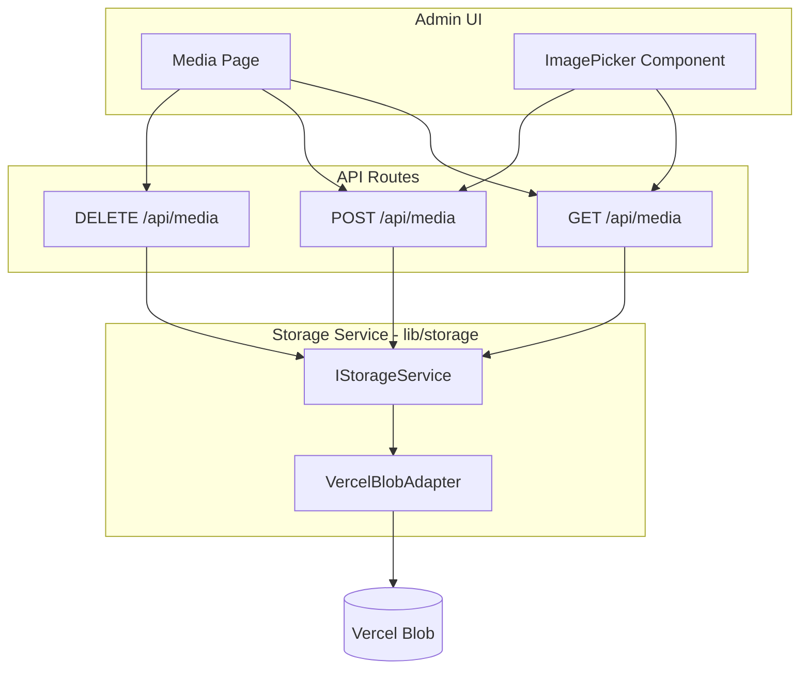

# Media Section and Storage Service Implementation

## Current State

- **Storage**: Direct `@vercel/blob` usage in `[app/api/upload/route.ts](app/api/upload/route.ts)` (put only); `[lib/blob.ts](lib/blob.ts)` provides token helpers
- **Image selection**: Header logo and Page banners use upload + URL input; SectionEditor (textImage, imageSlider, cards) and ServiceEditor use **URL text only** (no picker)
- **No Media section** in admin; no list/delete for uploaded files

---

## Architecture




---

## Part 1: Global Storage Service

Create a storage abstraction in `lib/storage/` so the backend can be swapped (e.g., Vercel Blob today, S3 later) without changing API routes or UI.

**New files:**

- `lib/storage/types.ts` – Interface and shared types
- `lib/storage/vercel-adapter.ts` – Vercel Blob implementation
- `lib/storage/index.ts` – Export adapter and factory

**Interface (RESTful-style methods):**

```ts
// lib/storage/types.ts
export interface StorageBlob {
  url: string
  pathname: string
  size: number
  uploadedAt: Date
}

export interface ListResult {
  blobs: StorageBlob[]
  cursor?: string
  hasMore: boolean
}

export interface IStorageService {
  upload(file: File, prefix?: string): Promise<{ url: string }>
  list(options?: { prefix?: string; cursor?: string; limit?: number }): Promise<ListResult>
  delete(urlOrPathname: string | string[]): Promise<void>
}
```

**Vercel adapter** wraps `put`, `list`, `del` from `@vercel/blob`, using `getBlobToken()` from existing `[lib/blob.ts](lib/blob.ts)`. Throws if token not configured.

**Factory:** `getStorageService(): IStorageService` returns the current adapter (Vercel). Later: env var or config to switch providers.

---

## Part 2: Media API Routes

Replace direct Blob usage with the storage service.


| Method | Route        | Purpose                                           |
| ------ | ------------ | ------------------------------------------------- |
| GET    | `/api/media` | List blobs (query: `prefix`, `cursor`, `limit`)   |
| POST   | `/api/media` | Upload file (FormData: `file`, optional `prefix`) |
| DELETE | `/api/media` | Delete blob (query: `url` or body: `{ url }`)     |


- Auth: require session (same as current upload)
- Migrate `[app/api/upload/route.ts](app/api/upload/route.ts)` logic into POST `/api/media`; keep `/api/upload` as a thin wrapper that forwards to the storage service for backward compatibility, or deprecate and update all callers to `/api/media`.

---

## Part 3: Media Admin Section (Subtask 1)

**Route:** `/admin/media`

**Files:**

- `app/(admin)/admin/media/page.tsx` – Media library page
- `components/admin/MediaLibrary.tsx` – Main UI component

**Features:**

- Grid of thumbnails from `GET /api/media` (paginated)
- Upload area (drag-and-drop + file input) → `POST /api/media`
- Delete button per item → `DELETE /api/media`
- Optional: filter by prefix (e.g., `media/`, `header/`)

**Sidebar:** Add "Media" link in `[components/admin/Sidebar.tsx](components/admin/Sidebar.tsx)` (e.g., between Sections and Settings).

---

## Part 4: ImagePicker Component (Subtask 2)

**New component:** `components/admin/ImagePicker.tsx`

**Props:** `value: string`, `onChange: (url: string) => void`, `label?: string`, `accept?: string`

**Behavior:**

- Shows current image preview + URL input (for external URLs)
- "Choose from Media" button opens a modal:
  - Grid of media from `GET /api/media`
  - "Upload new" in modal
  - On select: set URL and close
- "Upload new" (outside modal): upload via `POST /api/media`, set URL on success

**Integration points:**


| Location                                                            | Current                                         | Change                     |
| ------------------------------------------------------------------- | ----------------------------------------------- | -------------------------- |
| `[HeaderSettingsForm.tsx](components/admin/HeaderSettingsForm.tsx)` | Upload + URL input                              | Replace with `ImagePicker` |
| `[PageEditor.tsx](components/admin/PageEditor.tsx)`                 | Two upload inputs (banner bg, banner image)     | Replace with `ImagePicker` |
| `[SectionEditor.tsx](components/admin/SectionEditor.tsx)`           | URL text inputs (textImage, imageSlider, cards) | Replace with `ImagePicker` |
| `[ServiceEditor.tsx](components/admin/ServiceEditor.tsx)`           | URL text input                                  | Replace with `ImagePicker` |


---

## File Structure Summary

```
lib/
  storage/
    types.ts          # IStorageService, StorageBlob, ListResult
    vercel-adapter.ts # Vercel Blob implementation
    index.ts          # getStorageService(), exports
app/
  api/
    media/
      route.ts        # GET (list), POST (upload), DELETE
    upload/
      route.ts        # Keep as thin wrapper → storage.upload() for backward compat
app/(admin)/admin/
  media/
    page.tsx          # Media library page
components/admin/
  MediaLibrary.tsx    # Media grid, upload, delete
  ImagePicker.tsx     # Reusable picker (modal + upload)
  Sidebar.tsx         # Add Media nav item
  HeaderSettingsForm.tsx  # Use ImagePicker
  PageEditor.tsx      # Use ImagePicker (x2)
  SectionEditor.tsx   # Use ImagePicker (textImage, imageSlider, cards)
  ServiceEditor.tsx   # Use ImagePicker
```

---

## Prefix Strategy

- **Media section uploads:** Use `media/` prefix
- **Context-specific uploads** (header, page-banner, etc.): Keep existing prefixes (`header`, `page-banner`, `page-banner-image`) for organization; ImagePicker uploads can use `media/` or a context-specific prefix
- **List:** Media page lists all blobs (no prefix filter by default); optional prefix filter in UI

---

## Migration Notes

- No database changes; media metadata lives in Vercel Blob
- Existing blob URLs remain valid
- `/api/upload` can stay as a wrapper to avoid breaking any external integrations; new code uses `/api/media`

