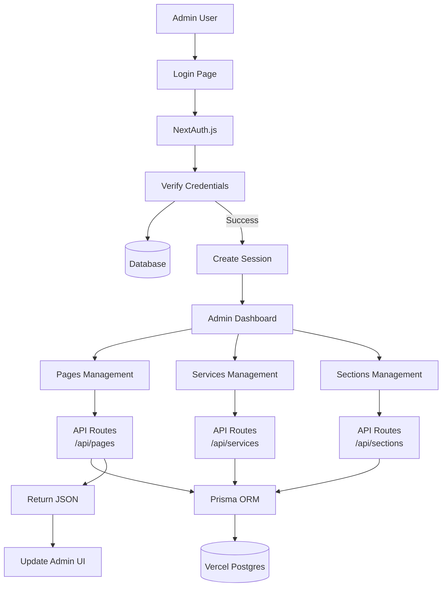
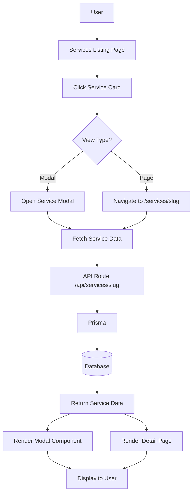

# Next.js CMS Development Plan

## Database Recommendation

**Primary Choice: Vercel Postgres (PostgreSQL)**

Vercel Postgres is the optimal choice because:
- **No external hosting required** - Managed by Vercel, integrates seamlessly
- **Serverless-ready** - Auto-scales with your Next.js app
- **Zero configuration** - Works out of the box with Vercel deployments
- **Relational data support** - Perfect for pages, sections, and services structure
- **Free tier available** - Hobby plan includes 256 MB storage
- **Connection pooling** - Built-in for serverless functions

**Alternative (if needed later):** MongoDB Atlas (serverless tier) for more flexible document structures, but PostgreSQL is recommended for the relational nature of pages/sections.

## Architecture Overview

### Technology Stack

- **Framework:** Next.js 14+ (App Router)
- **Language:** TypeScript
- **Database:** Vercel Postgres (PostgreSQL)
- **ORM:** Prisma (type-safe database access)
- **Authentication:** NextAuth.js v5 (Auth.js)
- **Styling:** Tailwind CSS
- **UI Components:** shadcn/ui (modern, minimal components)
- **Image Handling:** Next.js Image + Vercel Blob Storage (for media)

### Project Structure

```
cms/
├── app/
│   ├── (public)/              # Public routes
│   │   ├── page.tsx           # Home page
│   │   ├── about/page.tsx     # About page
│   │   ├── services/
│   │   │   ├── page.tsx       # Services listing
│   │   │   └── [slug]/page.tsx # Service detail page
│   │   ├── contact/page.tsx   # Contact page
│   │   └── [...slug]/page.tsx # Dynamic catch-all for CMS pages
│   ├── (admin)/               # Admin routes (protected)
│   │   ├── admin/
│   │   │   ├── layout.tsx     # Admin layout with sidebar
│   │   │   ├── page.tsx       # Admin dashboard
│   │   │   ├── pages/
│   │   │   │   ├── page.tsx   # Pages management
│   │   │   │   └── [id]/page.tsx # Edit page
│   │   │   ├── services/
│   │   │   │   ├── page.tsx   # Services management
│   │   │   │   └── [id]/page.tsx # Edit service
│   │   │   └── sections/
│   │   │       └── page.tsx   # Section types management
│   │   └── api/auth/[...nextauth]/route.ts
│   ├── api/
│   │   ├── pages/             # Page CRUD endpoints
│   │   ├── sections/          # Section CRUD endpoints
│   │   ├── services/          # Service CRUD endpoints
│   │   └── media/             # Media upload endpoints
│   └── layout.tsx             # Root layout
├── components/
│   ├── public/                # Public-facing components
│   │   ├── sections/         # Section renderers
│   │   │   ├── TextImageSection.tsx
│   │   │   ├── ImageSliderSection.tsx
│   │   │   ├── HeadingParagraphSection.tsx
│   │   │   └── SectionRenderer.tsx # Dynamic section loader
│   │   ├── services/
│   │   │   ├── ServiceCard.tsx
│   │   │   ├── ServiceModal.tsx
│   │   │   └── ServiceList.tsx
│   │   └── layout/
│   │       ├── Header.tsx
│   │       └── Footer.tsx
│   └── admin/                 # Admin components
│       ├── Sidebar.tsx
│       ├── PageEditor.tsx
│       ├── SectionEditor.tsx
│       └── ServiceEditor.tsx
├── lib/
│   ├── db/
│   │   └── prisma.ts          # Prisma client
│   ├── auth.ts                # NextAuth configuration
│   └── utils.ts
├── prisma/
│   ├── schema.prisma          # Database schema
│   └── migrations/
└── types/
    └── cms.ts                  # TypeScript types
```

## Database Schema Design

### Core Tables

```prisma
// User authentication
model User {
  id            String   @id @default(cuid())
  email         String   @unique
  password      String   // Hashed with bcrypt
  name          String?
  role          String   @default("admin")
  createdAt     DateTime @default(now())
  updatedAt     DateTime @updatedAt
}

// Dynamic pages
model Page {
  id            String   @id @default(cuid())
  slug          String   @unique
  title         String
  metaTitle     String?
  metaDescription String?
  isPublished   Boolean  @default(false)
  sections      Section[]
  createdAt     DateTime @default(now())
  updatedAt     DateTime @updatedAt
}

// Flexible sections system
model Section {
  id            String   @id @default(cuid())
  pageId        String
  page          Page     @relation(fields: [pageId], references: [id], onDelete: Cascade)
  type          String   // "textImage", "imageSlider", "headingParagraph", etc.
  order         Int      @default(0)
  content       Json     // Flexible JSON for section-specific data
  isVisible     Boolean  @default(true)
  createdAt     DateTime @default(now())
  updatedAt     DateTime @updatedAt
  
  @@index([pageId, order])
}

// Services
model Service {
  id            String   @id @default(cuid())
  slug          String   @unique
  title         String
  description   String?  @db.Text
  shortDescription String?
  image         String?
  content       Json?    // Rich content sections
  isPublished   Boolean  @default(false)
  order         Int      @default(0)
  createdAt     DateTime @default(now())
  updatedAt     DateTime @updatedAt
}
```

### Schema Flexibility Strategy

**Phase 1 (Initial):** Predefined section types with structured JSON
- `textImage`: `{ text: string, image: string, alignment: "left" | "right" }`
- `imageSlider`: `{ images: string[], autoplay: boolean }`
- `headingParagraph`: `{ heading: string, paragraphs: string[] }`

**Phase 2 (Future):** Dynamic section type definitions
- Add `SectionType` model to define new section types via admin
- Store section schemas in database
- Render sections dynamically based on stored schemas

## Data Flow Architecture

### Public Frontend Flow

```mermaid
flowchart TD
    User[Public User] --> NextJS[Next.js App Router]
    NextJS --> RouteCheck{Route Type}
    
    RouteCheck -->|Static| StaticPage[Static Page<br/>home, about, contact]
    RouteCheck -->|Dynamic| DynamicPage[Dynamic Page<br/>[...slug]]
    RouteCheck -->|Services| ServicePage[Services Listing/Detail]
    
    StaticPage --> PageComponent[Page Component]
    DynamicPage --> FetchPage[Fetch Page from DB]
    ServicePage --> FetchService[Fetch Services from DB]
    
    FetchPage --> Prisma[Prisma ORM]
    FetchService --> Prisma
    Prisma --> VercelPostgres[(Vercel Postgres)]
    
    PageComponent --> SectionRenderer[Section Renderer]
    SectionRenderer --> SectionComponents[Section Components<br/>TextImage, Slider, etc.]
    
    SectionComponents --> Render[Render to User]
```

### Admin Dashboard Flow



### Service Detail View Flow



## Implementation Phases

### Phase 1: Foundation Setup
1. Initialize Next.js project with TypeScript
2. Set up Prisma with Vercel Postgres
3. Create database schema (User, Page, Section, Service)
4. Configure NextAuth.js for admin authentication
5. Set up Tailwind CSS and shadcn/ui components

### Phase 2: Public Frontend
1. Create public layout (Header, Footer)
2. Build static pages (Home, About, Contact)
3. Implement dynamic page routing (`[...slug]`)
4. Create section renderer system
5. Build initial section components (TextImage, ImageSlider, HeadingParagraph)
6. Implement services listing page
7. Add service detail page route
8. Create service modal component

### Phase 3: Admin Dashboard
1. Create admin layout with sidebar navigation
2. Build admin dashboard home page
3. Implement pages management (CRUD)
4. Build page editor with section management
5. Create services management interface
6. Add section type management (for future extensibility)
7. Implement media upload functionality

### Phase 4: SEO & Optimization
1. Add dynamic metadata generation for pages
2. Implement structured data (JSON-LD)
3. Set up ISR (Incremental Static Regeneration) for dynamic pages
4. Optimize images with Next.js Image component
5. Add sitemap generation

### Phase 5: Future Extensibility
1. Create section type definition system
2. Build dynamic section schema editor
3. Add section template marketplace
4. Implement versioning/history for pages
5. Add preview mode for unpublished content

## Key Implementation Details

### Dynamic Page Rendering

**File:** `app/(public)/[...slug]/page.tsx`
- Catch-all route for dynamic pages
- Fetch page by slug from database
- Render sections in order
- Handle 404 for non-existent pages

### Section Renderer System

**File:** `components/public/sections/SectionRenderer.tsx`
- Maps section type to component
- Handles missing section types gracefully
- Supports lazy loading for performance

### API Route Pattern

**Example:** `app/api/pages/route.ts`
- GET: Fetch all pages or single page
- POST: Create new page (admin only)
- PUT: Update page (admin only)
- DELETE: Delete page (admin only)
- Use NextAuth session check for admin routes

### Service Detail Implementation

Both modal and page route:
- Modal: Client component with state management
- Page: Server component with dynamic route
- Shared service data fetching logic
- Consistent styling between both views

## SEO Strategy

1. **Dynamic Metadata:** Generate meta tags from page data
2. **Structured Data:** Add JSON-LD for services and pages
3. **Sitemap:** Auto-generate from database pages
4. **ISR:** Revalidate pages on content update
5. **Open Graph:** Dynamic OG tags for social sharing

## Deployment Considerations

1. **Environment Variables:**
   - `DATABASE_URL` (Vercel Postgres connection string)
   - `NEXTAUTH_SECRET` (for session encryption)
   - `NEXTAUTH_URL` (deployment URL)

2. **Vercel Configuration:**
   - Enable serverless functions
   - Configure ISR revalidation
   - Set up environment variables in Vercel dashboard

3. **Database Migrations:**
   - Run Prisma migrations on deployment
   - Use Vercel Postgres migration scripts

## Security Considerations

1. **Authentication:** NextAuth.js handles secure sessions
2. **API Protection:** Middleware to check admin role
3. **SQL Injection:** Prisma prevents S